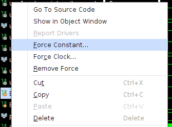

# [UCCA](https://ieeexplore.ieee.org/abstract/document/10745829):

Micro-controller units (MCUs) implement the de facto interface between the physical and digital worlds. Thus they appear in a variety of sensing/actuation applications, from smart personal spaces to complex industrial control systems and safety-critical medical equipment. While many of these devices perform safety- and time-critical tasks, they often lack support for security features compatible with their importance to overall system functions. This lack of architectural support leaves them vulnerable to run-time attacks that can remotely alter their intended behavior, with potentially catastrophic consequences. In particular, we note that MCU software often includes untrusted third-party libraries (some of them closed-source) that are blindly used within MCU programs, without proper isolation from the rest of the system. In turn, a single vulnerability (or intentional backdoor) in one such third-party software can often compromise the entire MCU software state.

In this paper, we tackle this problem by proposing, demonstrating security, and formally verifying the implementation of UCCA: an <ins>U</ins>ntrusted <ins>C</ins>ode <ins>C</ins>ompartment <ins>A</ins>rchitecture. UCCA provides flexible hardware-enforced isolation of untrusted code sections (e.g., third-party software modules) in resource-constrained and time-critical MCUs. To demonstrate UCCA's practicality, we implement an open-source version of the design on a real resource-constrained MCU: the well-known TI MSP430. Our evaluation shows that UCCA incurs little overhead and is affordable even to lowest-end MCUs, requiring significantly less overhead and assumptions than prior related work.

### UCCA Directory Structure

	├── co-located_isr
	│   └── simulation
	├── generic_app
	│   └── simulation
	├── img
	├── msp_bin
	├── openmsp430
	│   ├── contraints_fpga
	│   ├── fpga
	│   ├── msp_core
	│   ├── msp_memory
	│   ├── msp_periph
	│   └── simulation
	├── scripts
	│   ├── build
	│   │   └── hardware_templates
	│   └── verif-tools
	├── simple_app
	│   └── simulation
	├── two_isrs
	│   └── simulation
	├── ucca
	│   ├── hw-mod
	│   └── hw-mod-nusmv
	│       ├── UCCA
	│       ├── cr_integrity
	│       ├── return_integrity
	│       └── stack_integrity
	├── utils
	├── verification_specs
        ├── video_tutorials
	├── violations_cr_integrity
	│   ├── cr_write_fst
	│   │   └── simulation
	│   ├── cr_write_last
	│   │   └── simulation
	│   └── cr_write_mid
	│       └── simulation
	├── violations_region_validity
	│   ├── invalid_region_eq
	│   │   └── simulation
	│   └── invalid_region_lt
	│       └── simulation
	├── violations_return_integrity
	│   ├── isr_return_invalid
	│   │   └── simulation
	│   ├── malicious_return_complex
	│   │   └── simulation
	│   └── malicious_return_simple
	│       └── simulation
	└── violations_stack_integrity
	    ├── isr_write_invalid
	    │   └── simulation
	    ├── isr_write_valid
	    │   └── simulation
	    ├── malicious_stack_write_complex
	    │   └── simulation
	    ├── malicious_stack_write_simple
	    │   └── simulation
	    └── write_to_pointer
	        └── simulation

## Video Tutorials

Videos demonstrating everything discussed below can be found in the `video_tutorials` directory

## Dependencies Installation

UCCA was developed and formally verified on an Ubuntu 20.04.2 device with a 3.7GHz Intel Xeon W-2145 CPU

To install UCCA's dependencies on Ubuntu, run:

     sudo apt-get install bison pkg-config gawk clang flex gcc-msp430 iverilog tcl-dev
     cd scripts
     sudo make install

**Note:** When testing on Ubuntu 22.04, we ran into an issue when running `sudo make install`. When building the `passes/sat/freduce.o` functionality (64% through the installation) the make script threw an error stating that:

     `numeric_limits` is not a member of `std`
     
To the best of our knowledge, this seems to be a change in more recent versions of C++, but we are not certain when this change officially occurred. As such if you run into this error, navigate to the `scripts/verif-tools` directory and open `verilog2smv-1.1.2.tar.bz2`. Once in the archive, enter the `lib` directory and open `yosys-master.zip`. Finally in `yosys-master.zip` go to `passes/sat/` and open `freduce.cc`. Then to fix the error simply add the following include statement to the file:

     #include <limits>

## Building UCCA Software 

This repository includes 7 categories of test cases: co-located_isr, generic_app, simple_app, two_isrs, violations_cr_integrity, violations_return_integrity, and violations_stack_integrity. Three categories (co-located_isr, simple_app, and two_isrs) reflect benign executions while another three categories represent control-flow attacks/violations of UCCA's security guarantees (violations_X). Finally, generic_app is a special test case that enables easy customization for testing UCCA with arbitrary binaries. For more details about each category and its respective tests see [Description of Provided Test Cases](#description-of-provided-test-cases).

To generate the Microcontroller's program memory configuration containing one of these sample applications and respective UCC definitions (CR), use the Makefile inside the scripts directory:

     cd scripts
     make "name of test-case"

For example, run:

     cd scripts
     make simple_app

to build the software included in the simple_app test case.

**Note:** When building any test for the first time, you may need to give execute permissions (chmod +x) to `/scripts/build/uccasim` and `/scripts/build/ihex2mem.tcl`

**Note:** Running make only generates the MSP430 binaries corresponding to the chosen test case. This step will not execute/simulate the program. 

As a result of the build, two files, `pmem.mem` and `cr.mem`, should be created inside the `msp_bin` directory:

- pmem.mem: program memory contents corresponding to the application binaries

- cr.mem: contains UCC definitions.

Make will also build the appropriate hardware files for the chosen test. Specifically, the script will automatically add the required wires and submodules to `CR_peripheral.v`, `hwmod.v`, `openMSP430_fpga.v`, and `openMSP430.v` to support the UCCs used in the test. The Makefile also edits `CR_integrity.v` to ensure it covers the entirety of CR for the test. By default, all tests use 3 UCCs and the base hardware included in the repository is configured for 3 UCCs. As such this automatic hardware generation will only matter if you change the number of UCCs used by any test.

Later when synthesizing the hardware, these generated files will be loaded to the MSP430's memory and then used by Vivado's simulation tools to simulate UCCA's behavior.

If you want to clean the built files run:

    make clean

**Note**: UCCA was last tested with msp430-gcc (GCC) 4.6.3 (August 10th, 2024)

To test UCCA with a different application you will need to repeat these steps to generate a new `pmem.mem` file and re-synthesize the hardware (as described in the following section).

## Installing Vivado, Creating a Project, and Synthesizing UCCA

In this work, we synthesized UCCA using the Xilinx Vivado v2022.1 (64-bit) design suite for Linux and deployed our prototype on a Basys3 prototyping board with Artix-7 FPGA.  

**Note:** While built using Vivado 2022.1, UCCA was last tested on Vivado 2024.1 (August 10th, 2024)

- Vivado IDE is available to download at: https://www.xilinx.com/support/download.html

- Basys3 Reference/Documentation is available at: https://reference.digilentinc.com/basys3/refmanual

**Note:** When installing Vivado, the installation may hang indefinitely at the `final processing` step. To avoid this install the following packages:

     apt-get install libtinfo5 libncurses5

#### Creating a Vivado Project for UCCA

1 - Clone this repository;

2 - Follow the steps in [Building UCCA Software](#building-UCCA-software) to generate the `*.mem` files for the application of your choice.

3 - Start Vivado. Once loaded, on the upper left select: File -> New Project

4 - Follow the wizard, select a project name, and select a location. In project type, select RTL Project and click Next.

5 - In the "Add Sources" window, select Add Files and add all the `*.v` and `*.mem` files contained in the following directories of this repository:

     openmsp430/fpga
     openmsp430/msp_core
     openmsp430/msp_memory
     openmsp430/msp_periph
     /ucca/hw-mod
     /msp_bin

then select Next.

**Note:** /msp_bin contains the `pmem.mem` and `cr.mem` binaries, generated in step [Building UCCA Software](#building-UCCA-software).

6 - In the "Add Constraints" window, select add files and add the file

     openmsp430/contraints_fpga/Basys-3-Master.xdc

then select Next.

**Note:** This file needs to be modified accordingly if you are running UCCA on a different FPGA.

7 - In the "Default Part" window select "Boards", search for Basys3, select it, and click Next.

**Note:** If you don't see Basys3 as an option you may need to press the refresh button in the bottom left of the window. Once the refresh finishes, the board should be visible but will need to be downloaded before you can use it. Simply press the downloaded icon and the Basys3's entry.

8 - Select "Finish". This will conclude the creation of a Vivado Project for UCCA.

Now we need to configure the project for systhesis.

9 - In the PROJECT MANAGER `Sources` window, search for the openMSP430_fpga (`openMSP430_fpga.v`) file, right-click it, and select "Set as Top".
This will make `openMSP430_fpga.v` the top module in the project hierarchy. When set, its name should appear in bold.

10 - In the same `Sources` window, search for the `openMSP430_defines.v` file, right-click it, select "Set File Type", and select "Verilog Header" from the dropdown menu.

Now we are ready to synthesize the openmsp430 and UCCA hardware. The following step might take several minutes.

11 - On the left menu of the PROJECT MANAGER click "Run Synthesis" and select execution parameters (e.g., number of CPUs used for synthesis) according to your PC's capabilities.

12 - If the synthesis succeeds, you will be prompted with the next step to "Run Implementation". You ***do not*** need to "Run Implementation" to simulate UCCA. Instead, just close the dialog box.

To simulate UCCA using Vivado's sim-tools, continue following the instructions in [Running UCCA on Vivado Simulation Tools](#running-ucca-on-vivado-simulation-tools).

## Running UCCA on Vivado Simulation Tools

After completing the steps in [Creating a Vivado Project for UCCA](#creating-a-vivado-project-for-ucca):

1 - In Vivado, click "Add Sources" (Alt-A), then select "Add or create simulation sources", click "Add Files", and select everything inside the `openmsp430/simulation/` directory.

2 - Now, navigate to the `Sources` window in Vivado. Search for `tb_openMSP430_fpga` in the `Simulation Sources` collapsable menu, right-click `tb_openMSP430_fpga.v`, and select "Set as Top".

3 - Go back to the Vivado window and in the `Flow Navigator` tab (on the left-most part of Vivado's window), click "Run Simulation", then "Run Behavioral Simulation".

4 - On the newly opened simulation window, select a time for your simulation to run (see important times for each default test case below) and press "Shift+F2" to run.

5 - In the green waveform window you will see values for several signals. This window includes many signals important to demonstrating UCCA's protections. By default, the waveform includes the following signals:

     - pc: The currently executing instruction
     - ucca_reset: The main reset wire of UCCA indicating if any violation of UCCA protections has occurred
     - cr_integrity_reset: The reset signal from UCCA's CR integrity sub-module
     - W_en: The write enabled bit indicating if the MCU is writing to memory
     - D_addr: The memory address to which the MCU is reading/writing
     - SP: The current value of the stack pointer
     - gie: The general/global interrupt enable bit indicating if interrupts are enabled on the device
     - IRQ_jmp: The IRQ_jmp bit indicating if a jump to an ISR is occurring
     - OP_ret: The Operation return address which holds the return address of jump, call, and exec instructions

Along with these generic signals, the waveform also includes UCC-specific signals for a better understanding of the device state, what triggered a violation, and why. These signals are:

     - uccx_state: Which state (from the sub-module finite state machines) the UCC is in
     - uccx_return_integrity_reset: The reset signal from the UCC's return integrity sub-module
     - uccx_expected_return: The Ret_exp value saved when execution enters the UCC
     - uccx_stack_integrity_reset: The reset signal from UCC's stack integrity sub-module
     - uccx_base_pointer: The base pointer value for UCC's isolated stack frame

where x is the ID of the UCC (e.g. ucc1, ucc2, etc.). To add more signals to the waveform navigate to the `Scope` window and select a hardware module (e.g., dut->openMSP430_0->hdmod_0). Once a module is selected, the `Objects` window will show all the wires and registers defined in the module. To add a signal to the waveform, right-click the value in the `objects` menu and select "Add to Wave Window".

All the provided test cases are designed to loop infinitely, however, only simple_app, co_located_isr, two_isrs, and the default generic_app will loop properly. The remaining test cases will violate UCCA's security properties and trigger a device reset in the middle of the program.

To determine the address of an instruction, e.g., the start and end addresses of a UCC (values of UCC_min and UCC_max, per UCCA's paper) one can check the compilation file at `scripts/tmp-build/XX/ucca.lst` (where XX is the name of the test case, i.e., if you run `make simple_app`, XX=simple_app). In this file search for the name of the function of interest, e.g., `regionOne` or `secureFunction`, etc., locate the desired instruction, and fetch its memory address.

**NOTE:** To simulate a different test case you need to re-run `make test-case_name` to generate the corresponding `pmem.mem` file and re-run the synthesis step (step 11 in [Creating a Vivado Project for UCCA](#creating-a-vivado-project-for-ucca)) on Vivado. 

## Description of Provided test-cases

For details on how UCCA creates isolated regions of memory (UCCs) and mitigates attack escalation please check the UCCA [paper](https://arxiv.org/abs/2312.02348). 

All provided test cases support three UCCs, however, not every test uses all three. The first UCC isolates a vulnerable buffer copy that is meant to simulate user input. The second UCC isolates the password comparison functionality. The password comparison function is not vulnerable and does not need to be isolated, however, this isolation allows for better testing of UCCA with multiple UCCs. The third UCC is used to isolate ISRs from the rest of the system. While this is the default configuration, some tests do alter this isolation scheme. We explicitly state when tests break from this convention. All test cases were configured to run as is. If edited, the region definitions at the top of the respective test's main.c may need to be adjusted. The only exception is generic_app which was built specifically to be edited. We will discuss generic_app in more detail later.

#### 1 - simple_app:

Simple_app implements a toy authentication program. First, the `getUserInput` function simulates a user entering their credentials. The "user-defined" password is then checked against the expected password (chaos) to authenticate the user. If successful `secureFunction` is called representing some secure functionality (incrementing a counter in this example). Then the program repeats.

Simple_app also contains a dummy Interrupt Service Routine. This ISR is empty, but execution will jump to the ISR when an interrupt occurs. The interrupt is mapped to `BTN0` on the device. To trigger the interrupt, locate `BTN0` in the simulation waveform window, right-click it, and select "Force Constant". In the resulting dialog box change the radix to "Binary" and set the value to 1. Then simply move the simulation a bit (we use 1 microsecond). After moving the simulation make sure to right-click `BTN0` again and select "Remove Force". This prevents the system from interrupting forever and potentially breaking the program. A visual walkthrough is provided below in [Triggering an Interrupt](#2--triggering-an-interrupt)

The UCCs are defined over the following regions: E23E-E296 (user input), E298-E2F4 (password comparison), and E100-E126 (ISR). To test UCCA's interruptabilty simply wait for execution to enter one of the first two UCCs and perform the steps described in the previous paragraph.

Simple_app's simulation runs indefinitely and the device is never reset (i.e. ucca_reset is always 0). In the default configuration the user successfully authenticates and `secureFunction` is called. As such execution will jump into the secure code (pc = E0DE). This jump occurs around 221 microseconds into the simulation.

Simple_app can be modified to simulate a failed authentication attempt. To do this simply open `main.c` in the `simple_app` directory and edit the "input" buffer on line 120. 

#### 2 - Triggering an Interrupt

As discussed in the previous section, to trigger an interrupt in the simulation you need to edit values within the simulation. For all tests, the test interrupt is triggered using `BTN0`. For tests with more than 1 interrupt the second interrupt is connected to `BTN1`. First, you will need to locate the button in the waveform.

    

    
Once found, right-click the button and select "Force Constant".

    

    
In the menu that opens up, you will need to set the appropriate value for the wire. To do that first click the dropdown menu next to "Value radix" and select binary.

    

    
Then for "Force value" enter 1 and press okay

    

    
Now the signal is set and you simply need to run the simulation for a single microsecond. This is enough for the system to detect the signal and begin the process of handling the interrupt. To prevent the system from continually interrupting you need to remove the force on the wire. To do this, once again right-click `BTN0` and select "Remove Force"

    

    
#### 3 - co-located_isr:

Co-located_isr is a variant of simple_app where the ISR is isolated within the second UCC alongside the password comparison functionality instead of its own UCC. This example demonstrates that if a UCC is interrupted but the execution does not leave the UCC, the UCC stays active (and protected) rather than pausing for the interrupt (as with non-UCC ISRs)

Similar to Simple_app, co-located_isr runs indefinitely and never resets (i.e. ucca_reset is always 0). This test is also configured to successfully authenticate by default. As such `secureFunction` should be called (pc = E0DE). This should occur around 221 microseconds into the test.

This test case only defines two UCCs; E216-E26E (user input) and E270-E2F4 (password comparison + ISR). To test UCCA's behavior when an ISR is defined within the same UCC being interrupted, wait until the second UCC is executing and trigger the test interrupt.  

#### 4 - two_isrs

Two_isrs is another benign clone of the simple_app program. Two_isrs, as the name suggests, implements two test interrupts. These interrupts share the third UCC and are separate from the rest of the code. This example demonstrates that neither interrupt is inhibited by UCCA's security guarantees and (if enabled) the interrupts can even interrupt each other. 

Just like the original test interrupt, the new interrupt can be triggered by performing the same steps on `BTN1` in the waveform window.

This is another test case that runs indefinitely (ucca_reset is always 0) and is configured to authenticate successfully by default. Thus the program will have successfully performed one iteration when `secureFunction` is called (pc = E0F6). This occurs around 236 microseconds into the simulation.

The UCCs are defined as follows: E2CE-E326 (user input), E328-E384 (password comparison), and E118-E1B6 (ISRs). Unlike the previous cases, these interrupts contain a counting loop. This just allows each ISR to run for longer making them easier to interrupt if desired. Similarly, an interrupt can only be triggered if the `gie` bit is high (set to 1). Thus once either ISR clears its interrupt flag, it also sets the `gie` bit back to 1. To simulate nested interrupts simply trigger an interrupt using one of the buttons, wait for the `gie` bit to go back to high, and then trigger the other interrupt with the remaining button. Remember to clear each button after the interrupt has been accepted to avoid undefined behavior.

#### 5 - generic_app

By default, generic_app is another clone of simple_app. However, generic_app was designed to ease testing UCCA with arbitrary/custom programs. To test a custom program, simply add your code to the `main_template.c` file in the `generic_app` directory. Next mark the untrusted functionality with the appropriate attribute tag:

     __attribute__ ((section (".region_X")))

where X is a number. Selecting different numbers for different untrusted functionality will isolate the code in separate UCCs. Next, navigate to the scripts directory and run:

     make generic_app 

This will compile the program, find and update the new UCC definitions automatically, and build the required hardware. Then simply resynthesize the Vivado project (step 11 in [Creating a UCC project on Vivado and RUnning Sythnesis](#creating-a-ucca-project-on-vivado-and-running-synthesis)) and rerun the simulation.

**Note:** If the application requires more than 8 UCCs you will need to:
- Add more UCC definitions to the top of the template file
- Add more UCCs to both the .text and .config sections of the `scripts/build/linker.msp430.x` file
- Update the `UCCS` constant at the top of the `scripts/build/region_defintions.py` file

#### 6 - violation_cr_integrity:

###### 6.1 - cr_write_fst

This corresponds to a test case where the program attempts to write to the first address in CR. CR Integrity is violated, `ucca_reset` is set to 1 and the device is reset (pc = 0).

This should occur around 29 microseconds into the simulation.

###### 6.2 - cr_write_last

This corresponds to a test case where the program attempts to write to the last address in CR. CR Integrity is violated, `ucca_reset` is set to 1 and the device is reset (pc = 0).

This should occur around 29 microseconds into the simulation.

###### 6.3 - cr_write_mid

This corresponds to a test case where the program attempts to write to the middle of CR. CR Integrity is violated, `ucca_reset` is set to 1 and the device is reset (pc = 0).

This should occur around 29 microseconds into the simulation.

#### 7 - violation_return_integrity:

###### 7.1 - isr_return_invalid

Isr_return_invalid corresponds to a test case where the ISR is untrusted and tries to return to an arbitrary location in the program. This violates return integrity for the UCC isolating the ISR, causes `ucca_reset` to be set to 1, and resets the device (pc = 0). To perform the test we simply instrument the ISR to jump to `secureFunction`.

To simulate the violation you need to trigger the interrupt. However, before you can trigger the interrupt the system must initialize. Thus attempts to trigger the interrupt within the first 30 microseconds of the simulation will be ignored. Once the system is configured and the interrupt is executing (pc = E100), the attack and subsequent reset should occur about 5 microseconds later in the simulation. 

###### 7.2 - malicious_return_complex

This test case corresponds to a test where execution jumps from the middle of a UCC to `UCC_max` (the final return) of the same UCC. Exploiting the vulnerable buffer within the `getUserInput` function causes the function to return to UCC_max. As execution hasn't left UCC no violation has occurred, however as execution maliciously jumped to the final instruction of UCC, the stack hasn't been properly cleaned. Data on the stack is misinterpreted as the return address for UCC causing it to return to the wrong address in memory. This violates return integrity, `ucca_reset` is set to 1, and the device is reset (pc = 0). 

This should occur around 133 microseconds into the simulation.

###### 7.3 - malicious_return_simple

This test corresponds to a test case where execution jumps from a UCC to an address that is not the correct return address. This violates return integrity, `ucca_reset` is set to 1, and the device is reset (pc = 0). This test is simple as the binary is instrumented to "perform the attack" rather than exploiting the overflow like in the complex case.

This should occur around 132 microseconds into the simulation.

#### 8 - violation_stack_integrity:

###### 8.1 - isr_write_invalid:

Isr_write_invalid corresponds to a test case where the implemented ISR is untrusted and attempts to overwrite the data of another function on the stack. This violates the stack isolation (ucca_reset = 1) resulting in a device reset (pc = 0). To simulate this behavior the ISR is simply instrumented to write directly to an address known to be below its UCC's base pointer.

Again this simply requires the interrupt to be triggered, however, the interrupt cannot be triggered within the first 30 microseconds of the simulation as the device is still being initialized. Once the interrupt has been triggered the violation and the subsequent device reset should occur within 5 microseconds

###### 8.2 - isr_write_valid:

This test corresponds to a test case where the ISR is benign and attempts to overwrite the data of another function on the stack. This demonstrates that unisolated ISRs maintain the ability to edit the stack as needed, even if they are interrupting a UCC (thus stack integrity was being enforced). 

The UCCs for this test are defined for the following regions of memory: E242-E29C (user input) and E29E-E300 (password comparison). Since the ISR is assumed benign in this scenario it isn't isolated and the third UCC is not used.

Like previous interrupt-based tests, this behavior can be performed anytime after the first 30 microseconds of the simulation. However, to best demonstrate the unlocking of the stack for interrupts the interrupt should be triggered from within another UCC. Execution first enters a UCC around 101 microseconds into the execution. From there simply trigger the interrupt. The ISR should run normally and execution will then return to the UCC.

**Note:** While the ISR write is valid, this test is just blindly writing to the stack. As such this demonstration will likely break the program. However, this does not reflect an attack against UCCA as it is assumed unisolated code is benign. Thus, in reality, an unisolated ISR would not (presumably) be purposely destroying the stack.

###### 8.3 - malicious_stack_write_complex

This case corresponds to a test where a UCC attempts to write to an address on the stack below its own stack frame (`D_addr` is below the base pointer). Exploiting the vulnerable buffer within the `getUserInput` function causes the UCC to attempt to write below its base pointer. This violates the stack isolation, `ucca_reset` is set to 1, and the device is reset (pc = 0).

This should occur around 233 microseconds into the simulation.

###### 8.4 - malicious_stack_write_simple

This directory corresponds to a test case where a UCC attempts to write to an address on the stack below its own stack frame (`D_addr` is below the base pointer). This violates the stack isolation, `ucca_reset` is set to 1, and the device is reset (pc = 0). This test is simple as the program is instrumented to write directly to the stack rather than exploiting the overflow like in the complex case above.

This should occur around 204 microseconds into the simulation.

###### 8.5 - malicious_stack_pointer

This case corresponds to a test case where a UCC attempts to write malicious data to the stack and return early thus corrupting the stack pointer and creating an adversarial controlled stack. This violates stack integrity as the stack pointer doesn't match the saved base pointer so `ucca_reset` is set to 1 and the device is reset. To make testing easier this sample program is instrumented similarly to malicious_return_simple.

The attack and subsequent reset should occur around 132 microseconds into the simulation.

###### 8.6 - write_to_pointer

This corresponds to a test case where a UCC attempts to write to an address on the stack below its own stack frame (`D_addr` is below the base pointer). A stack buffer is initialized outside the UCC and a reference to the buffer is passed to the UCC. When the UCC attempts to write this buffer stack isolation is violated, `ucca_reset` is set to 1, and the device is reset (pc = 0). This demonstrates that the stack isolation prevents references to variables on the stack from being used within a UCC. However, UCC can still access values in the heap as shown in simple_app and all other test cases.

This should occur around 114 microseconds into the simulation.

**Note:** Writes to reference variables do not inherently reflect malicious behavior, but rather this test demonstrates a byproduct of UCCA's security guarantees.

#### 9 - Examples of simulation test cases are provided below.

- Simulation window for a benign execution of simple_app: 

- Simulation window for a Violation example. the violation occurs at instruction PC=E25E causing `ucca_reset` to switch to 1 and the device to reset (PC = 0000): 

## Running UCCA Verification

The verification of UCCA's hardware against its LTL properties is split into 4 cases. Each of the implemented sub-modules is tested independently to allow the verification to be performed in a timely manner. Finally, some larger properties about reset correctness and equivalence are tested against the entire HW-Mod. While each module is tested independently, their properties still hold when combined into HW-Mod as each sub-module works independently of the others with two caveats. First, the UCC State sub-module provides information used by the checks of the Return and Stack Integrity modules. However, this doesn't affect the verification as the UCC State sub-module doesn't change regardless of which modules are present and performs no security checks of its own. Instead, it is simply a helper module to remove some repetition in the design. Second, each sub-module receives as input a copy of the master reset wire. This allows each module to be reset if another submodule or UCC is violated. As such violations in one sub-module cannot be used to break the protections enforced by another.

Note that when running the verification for the first time you may need to give execute permissions (chmod +x) to `/scripts/verif-tools/NuSMV`.

To check the Return Integrity sub-module against its associated UCCA LTL sub-properties using NuSMV run:

     make verify_return_integrity
        
To check the Stack Integrity sub-module against its associated UCCA LTL sub-properties using NuSMV run:

     make verify_stack_integrity
        
To check the CR Integrity sub-module against its associated UCCA LTL sub-properties using NuSMV run:

     make verify_cr_integrity
 
To check HW-Mod against its associated UCCA LTL sub-properties using NuSMV run:

     make verify_general

**Note:** Running the verification proofs may take some time. On our implementation verification of UCCA took about 12 minutes total to run. However, this time may vary based on your system.
